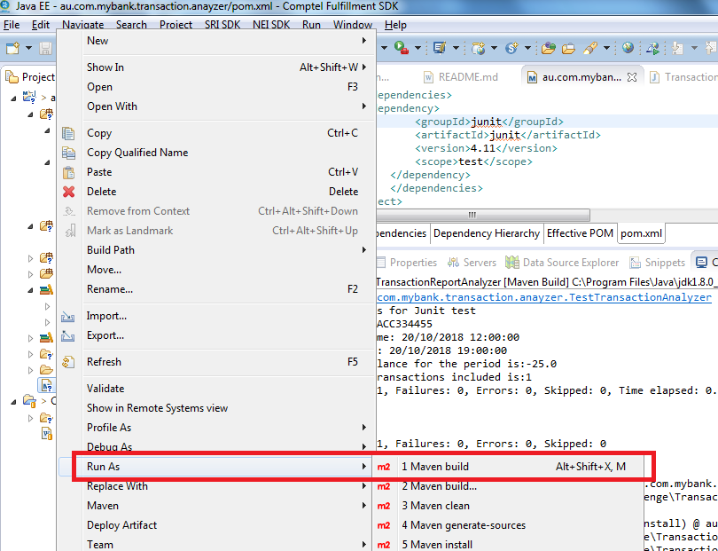
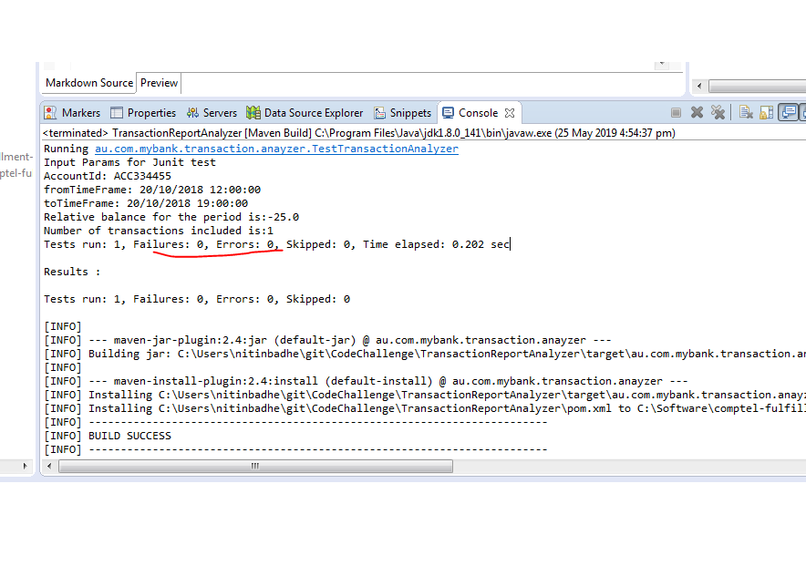
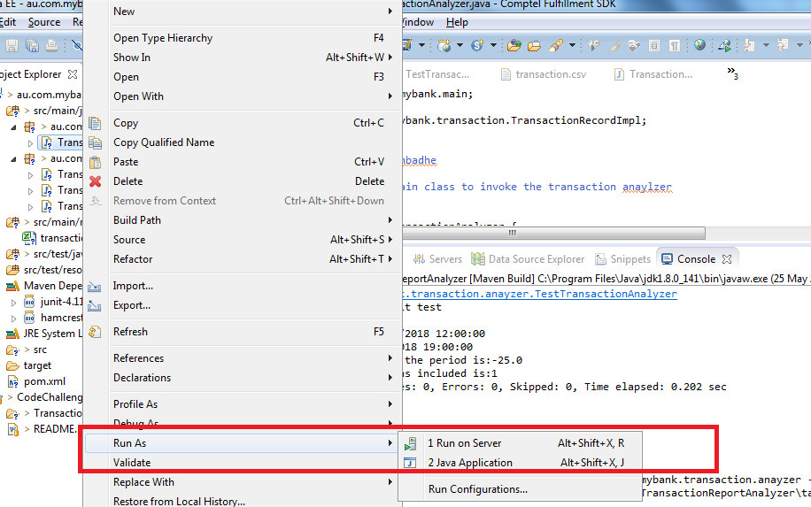

# CodeChallenge

#Project Transaction Analyzer

#### 1. Prerequisites
1. ECLIPSE or any IDE
2. JAVA JDK 1.8
3. MAVEN 3.x 
4. JUNIT 4.11

#### 2. build and run
1.Right click on the pom.xml

2.Run As maven build

3.Add goals clean install

4.After building it runs default tests and its output
 
 
   
#### 3. To run custom input arguments

1.Right click on the main class TransactionAnalyzer

2.Select runas Java Application

3.Provide the input params on console and view the output

